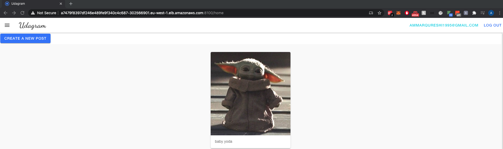

# udagram-microservice

A simple image sharing AWS cloud application.


* Frontend - Angular web application built with Ionic Framework
* Backend RESTful API - Node-Express application
    * Feed Service - handles image feeds 
    * User service - handles user authentication
  

  
  
infra/k8s has the secrets and configuration for the application to work

How to configure:

* aws-secret.yaml 
in your local machine, provided that you have configured your account using aws-cli

```cat ~/.aws/credentials | head -n 3``` 

this will output the first 3 lines of the file, which is the default profile

```cat ~/.aws/credentials | head -n 3 | base64```

this will output the base64 encoded version of it.

the encoded version needs to be copied into credentials field in aws-secret.yaml

* env-configmap.yaml consists of all the configuration that is required inside k8s cluster for the app to function properly. The URL should be your reverse proxy URL.


* env-secret.yaml
similarly for POSTGRES secret variables, you will need to feed in encoded base64 into env-secret.yaml

```echo -n $POSTGRES_PASSWORD | base64``` 

kubectl apply -f infra/k8s will create secret and configmap inside the cluster

```kubectl get secrets```


```kubectl get configmaps```


  
Docker Hub images:


AWS EKS cluster:


  
```kubectl get deployments```


```kubectl get services```


```kubectl get hpa```


Backend service functioning properly:


Running application:


  
